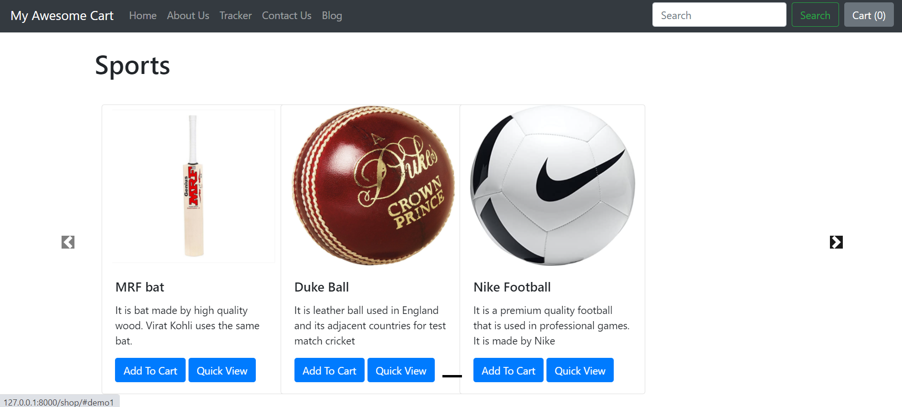

# MY AWESOME CART

- **My Awesome Cart** is a e-commerce website that was built using Django. The website is in development mode. The website is capable of creating purchase records and allows user to smoothly navigate through the website for the products that they desire.

- The UI of the project allows user to look at the _product pics_ and select a quantity to add to the their _order cart_

- User can navigate throigh their old orders as well by means of the orderID and the email address utilised for making order.

- Payment gateway will be shortly coming in the website. 

## Screenshots

**Note:** The website is still under development. I am trying to add more features the website so as to make it more attractive and user-friendly. I am open to suggestions.